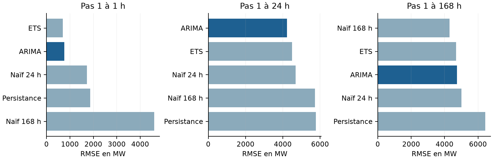
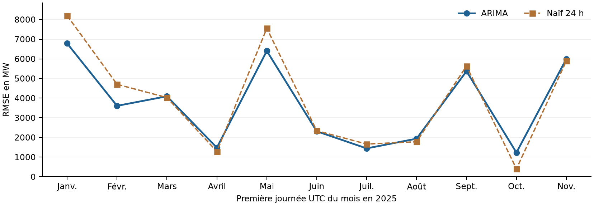
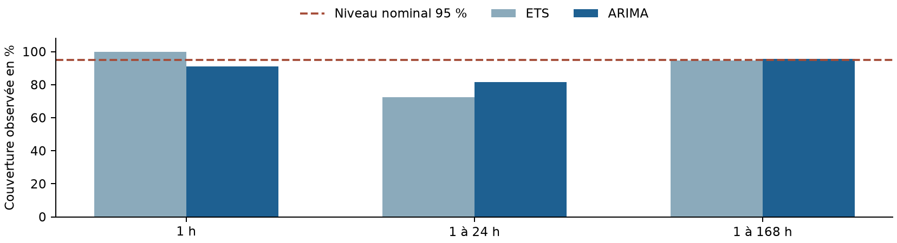

# Comparaison des versions du projet énergie France

Rapport complet de méthode et de résultats | Yahya Rahil | 9 octobre 2026

### Conclusion générale

La nouvelle version corrige les défauts qui empêchaient de considérer les anciens résultats comme des prévisions horaires valides. Elle définit une grille temporelle régulière, sépare validation et test, conserve des références simples et rend les résultats traçables. Elle constitue une base de recherche reproductible, mais ne démontre pas encore une fiabilité opérationnelle sur toutes les situations.

À 24 heures, ARIMA est sélectionné sur 2024 puis évalué sans nouvelle sélection sur onze origines de 2025. Sa RMSE atteint 4 226,7 MW et sa MAPE 6,98 %. Sur les mêmes cibles, la RMSE est inférieure de 9,96 % à celle du naïf 24 h. Ce gain porte sur le nouveau protocole uniquement.

| Indicateur | Ancienne version | Nouvelle version |
| --- | --- | --- |
| Meilleur modèle affiché / retenu | ETS | ARIMA choisi sur validation à 24 h |
| RMSE publiée | 7 231,00 MW | 4 226,72 MW à 24 h |
| MAPE publiée | 12,79 % | 6,98 % à 24 h |
| Périmètre | 500 pas irréguliers en 2023 | 264 cibles horaires sur 11 dates de 2025 |
| Comparaison directe des scores | Non valable entre versions | Valable entre modèles du nouveau test |

Les différences de niveau entre les deux colonnes ne sont pas une estimation du progrès prédictif : les cibles, la fréquence, les dates et l’horizon ont changé. Aucun pourcentage de gain ancien/nouveau n’est revendiqué.

### Trois réserves à conserver dans toute présentation

Le naïf hebdomadaire est meilleur à 168 h ; ARIMA ne bat le naïf 24 h que sur 6 des 11 journées de test ; la couverture de son intervalle nominal à 95 % n’est que de 81,44 % sur les pas 1 à 24 h. Ces constats limitent la portée du bon classement agrégé.

Le rapport détaille successivement les données, l’audit initial, les corrections, le protocole, les résultats, l’incertitude, les limites et la reproduction. Toutes les valeurs proviennent des fichiers du projet et des calculs décrits en fin de document.

## 1 Périmètre et provenance des données

L’objet est la prévision de la consommation électrique française exprimée en MW. Une valeur en MW décrit une puissance ; elle ne doit pas être confondue avec une énergie en MWh. Le rapport compare le dépôt initial ef8ca927 au code corrigé bc9f1338 et aux résultats générés le 9 octobre 2026.

| Élément | Ancienne préparation | Préparation corrigée |
| --- | --- | --- |
| Sources de travail | Dataset enrichi après jointures | Deux fichiers RTE bruts combinés |
| Volume en entrée | 1 154 808 lignes du dataset | 486 446 lignes RTE |
| Horodatages | 258 319 libellés distincts | 121 576 heures UTC sur la grille |
| Répétitions supplémentaires | 896 489 dates répétées | Aucune date répétée en sortie |
| Valeurs horaires complètes | Non établies par le protocole | 121 547 heures complètes |
| Heures manquantes ou partielles | Pas de contrôle horaire fiable | 29 conservées comme manquantes |
| Dernière heure complète | Non distinguée de la dernière ligne | 13 novembre 2025 à 13 h UTC |

Les nombres de lignes ne mesurent pas ici la quantité d’information : retirer les répétitions et agréger des mesures infrahoraires réduit normalement le nombre de lignes. Il ne faut pas présenter cette réduction comme une perte de 90 % des données.

### Qualité et nature des sources

Les fichiers locaux couvrent 2012 à novembre 2025. Les mesures 2012-2023 sont définitives, celles de 2024 consolidées et celles de 2025 en temps réel. RTE distingue les puissances moyennes issues des comptages des puissances instantanées temps réel. Leur nature et leur révision peuvent influencer les comparaisons entre années [S3, S4].

228 097 lignes sources sans consommation positive exploitable sont écartées ; une partie correspond aux quarts d’heure sans consommation dans les historiques demi-horaires. Cela ne signifie pas que 228 097 heures ont été perdues. Les 30 lignes ambiguës d’automne et les 30 lignes portant une heure inexistante du printemps sont exclues explicitement.

La grille va du 31 décembre 2011 à 23 h UTC au 13 novembre 2025 à 14 h UTC. Son début correspond au 1er janvier 2012 à 00 h en France. La dernière heure est partielle ; les prévisions exportées commencent à 14 h UTC après la dernière heure complète.

## 2 Ce que mesurait réellement la première version

La comparaison avancée transformait le dataset en série R de fréquence 24, puis conservait une ligne sur 23 pour limiter la taille à environ 50 000 valeurs. Cette extraction supprimait les attributs temporels : la fréquence devenait 1. Les intervalles réels entre valeurs restaient variables, le plus souvent 2 h 30.

| Étape | Résultat observé |
| --- | --- |
| Dataset initial | 1 154 808 lignes, nombreuses dates répétées |
| Après sous-échantillonnage | 50 210 valeurs, pas irrégulier |
| Entraînement à 80 % | 40 168 valeurs ; dernière date 17 septembre 2023 à 14 h 30 |
| Évaluation utilisée | 500 premières valeurs du test, environ 53 jours |
| Dates effectivement comparées | 17 septembre 2023 à 17 h 30 au 9 novembre 2023 à 21 h |

| Modèle enregistré | RMSE MW | MAPE % | R² |
| --- | --- | --- | --- |
| ETS | 7 231,00 | 12,79 | -0,264 |
| ARIMA auto | 7 399,37 | 13,01 | -0,323 |
| TBATS | 7 581,26 | 13,13 | -0,389 |

Le score ETS a été reproduit dans R lors de l’audit. Le modèle obtenu est ETS(A,N,N), sans tendance ni saisonnalité, avec une fréquence de 1. Il s’agit donc d’un résultat arithmétiquement reproductible obtenu avec une représentation du temps inadaptée à l’objectif horaire.

### La référence simple révèle la portée du score

Répéter la dernière consommation connue sur les mêmes 500 valeurs donne une RMSE de 7 231,06 MW, contre 7 231,00 MW pour ETS : environ 0,06 MW d’écart. Le classement ne démontrait pratiquement aucun gain face à la persistance.

Le R² négatif indique une erreur quadratique supérieure à celle de la moyenne du test connue après coup. Il ne prouve pas, à lui seul, une infériorité à la moyenne d’entraînement. Dans l’audit, cette dernière obtenait une RMSE de 10 613,56 MW.

Un autre ancien fichier affichait une RMSE de 5 701,57 et une MAPE de 12,02 % pour un horizon étiqueté 24. Ce fichier relevait d’un autre calcul ; ses 24 pas ne sont pas assimilables aux 24 heures régulières du nouveau test. Le présent rapport conserve cette distinction.

## 3 Corrections apportées et effets attendus

| Problème initial | Correction effective | Conséquence |
| --- | --- | --- |
| Jointures sur des heures arrondies non uniques | Repartir de Date et Consommation dans les fichiers RTE | Éviter la multiplication des mesures |
| Mesures de 15 ou 30 min traitées comme horaires | Moyenne pondérée et couverture de 3 600 s exigée | Une cible horaire définie |
| Sous-échantillonnage irrégulier et fréquence perdue | Fenêtre contiguë de 56 jours, série de fréquence 24 | Saisonnalité quotidienne conservée |
| Validation par blocs utilisant le futur | Origines chronologiques ; entraînement antérieur aux cibles | Absence de cette fuite temporelle |
| Naïfs calculés à un seul pas puis demandés à 500 | Références directement calculées au bon horizon | Comparaison effective de cinq méthodes |
| MASE normalisé par le test | Échelle saisonnière calculée sur chaque entraînement | Interprétation du MASE rétablie |
| R² infini avec une observation | Valeur indéfinie rendue NA | Pas de faux score numérique |
| Rapports et dashboard lisant des fichiers différents | Exports communs et lectures des seuls résultats corrigés | Cohérence de la présentation |

Les dates sans décalage UTC sont interprétées en Europe/Paris. L’automne comporte une heure civile répétée que ces libellés ne permettent pas de distinguer avec certitude. La nouvelle version conserve les trous plutôt que d’inventer une correspondance. Les heures UTC restent régulièrement espacées.

Les trous courts de l’entraînement, limités à six heures consécutives, sont remplis uniquement avec des valeurs passées : retard 168 h si possible, sinon 24 h, sinon la dernière valeur. Les cibles du test ne sont jamais imputées. Toute origine dont les cibles sont incomplètes est exclue pour tous les modèles.

Cette règle corrige une cause précise de biais. Elle ne garantit pas que toutes les hypothèses du projet sont désormais satisfaites : l’historique peut être révisé, les délais de publication ne sont pas simulés et l’imputation reste une approximation explicitement comptée.

## 4 Protocole de la nouvelle version

### Chronologie de la sélection et de l’évaluation

La validation utilise douze origines en 2024. Le test final utilise onze origines de janvier à novembre 2025. À chaque origine, les 1 344 heures précédentes, soit 56 jours, servent à entraîner les modèles. Les 168 heures suivantes constituent les cibles. Les paramètres du protocole sont fixés dans config_horaire.json.

Une origine correspond au début de la dernière heure complètement observée du mois précédent. La première cible est le premier jour du mois à 00 h UTC. Les prévisions sont produites une seule fois pour la fenêtre, sans intégrer les observations qui arrivent pendant ses sept jours. À l’origine mensuelle suivante, un nouvel entraînement utilise seulement le passé alors disponible dans l’historique.

| Méthode | Prévision et hypothèses |
| --- | --- |
| Persistance | Répète la dernière valeur observée. |
| Naïf 24 h | Répète le profil des 24 dernières heures. |
| Naïf 168 h | Répète le profil des 168 dernières heures. |
| ETS | Lissage exponentiel automatique sur une série de fréquence 24. |
| ARIMA saisonnier | auto.arima avec fréquence 24 ; recherche pas à pas approximative ; p/q au plus 2 et P/Q au plus 1. |

### Une sélection figée avant le test

ARIMA est choisi sur la plus faible RMSE des pas 1 à 24 de validation 2024. Le test 2025 compare les cinq méthodes, mais n’est pas utilisé pour modifier le choix ou les réglages. Aucun modèle ne peut disparaître silencieusement du classement : un échec de calcul interrompt l’exécution.

Les horizons 1, 24 et 168 décrivent des fenêtres cumulées : à 24 h, on regroupe les erreurs des pas 1 à 24 ; on ne mesure pas seulement la vingt-quatrième heure. On obtient 288 et 264 erreurs à 24 h en validation et en test, puis 2 016 et 1 848 à 168 h. Aucune des origines prévues n’a été exclue dans cette exécution.

Les cinq méthodes sont univariées. Aucune amélioration attribuable à la température, au PIB ou aux jours fériés n’est démontrée. Les retards 24/168 h sont définis en heures écoulées UTC ; ils ne coïncident pas toujours avec la même heure civile autour du changement d’heure. Le principe de validation par origine glissante suit [S2].

## 5 Lecture des métriques et comparabilité

| Mesure | Calcul et interprétation |
| --- | --- |
| RMSE en MW | Racine de la moyenne des erreurs au carré. Pénalise davantage les grandes erreurs. Plus faible est préférable. |
| MAE en MW | Moyenne des erreurs absolues. Donne un ordre de grandeur directement dans l’unité de consommation. |
| MAPE en % | 100 × moyenne de |observé - prévu| / observé. Une MAPE de 6,98 % ne constitue pas une précision de 93,02 %. |
| R² | 1 - somme des erreurs au carré / somme des écarts à la moyenne des cibles au carré. Peut être négatif ; indéfini si la variance est nulle. |
| MASE à retard 24 | Erreur absolue divisée par la moyenne de |y(t) - y(t-24)| sur l’entraînement de chaque origine. |
| Couverture et largeur | Part des observations à l’intérieur de l’intervalle et largeur moyenne en MW. Les deux doivent être examinées ensemble. |

Les scores agrégés sont calculés sur toutes les erreurs de la fenêtre et de toutes les origines admissibles. La RMSE agrégée n’est pas la moyenne arithmétique des RMSE mensuelles : avec des tailles égales, elle est la racine de leur moyenne quadratique. Les observations horaires d’une même fenêtre sont dépendantes ; 264 erreurs ne signifient pas 264 essais indépendants.

Le MASE de chaque erreur utilise l’échelle de son propre entraînement. Un MASE supérieur à 1 signifie que l’erreur normalisée dépasse cette échelle historique ; il ne signifie pas automatiquement que le naïf 24 h obtient un meilleur score sur le test considéré. Dans le nouveau test à 24 h, ARIMA a un MASE de 1,261 tout en améliorant la RMSE du naïf 24 h. Définitions générales des erreurs et de l’échelle : [S1].

### Comparaisons permises et interdites

Il est pertinent de comparer ARIMA, ETS et les naïfs sur les mêmes origines, horizons et observations du nouveau protocole. Il est aussi pertinent de comparer les méthodes de préparation et les contrôles des deux versions. Il n’est pas pertinent de calculer un gain scientifique en divisant simplement la nouvelle RMSE par l’ancienne.

Pour isoler l’effet d’un changement de modèle, il faudrait reconstruire deux variantes sur exactement la même grille corrigée et les mêmes fenêtres, avec des réglages décidés avant un nouveau test. Réintroduire volontairement les erreurs de données initiales ne constituerait pas une référence méthodologique valable.

## 6 Résultats de validation en 2024

Douze origines, une par mois. Les colonnes ci-dessous décrivent les mêmes cibles pour tous les modèles. La sélection du modèle s’effectue uniquement à 24 h ; les autres horizons apportent un diagnostic complémentaire.

| H (h) | Modèle | RMSE MW | MAE MW | MAPE % | R² | MASE |
| --- | --- | --- | --- | --- | --- | --- |
| 1 | Persistance | 2 126,3 | 1 951,5 | 4,28 | 0,917 | 0,794 |
| 1 | Naïf 24 h | 1 624,2 | 1 303,0 | 2,92 | 0,951 | 0,515 |
| 1 | Naïf 168 h | 3 361,1 | 2 096,1 | 4,83 | 0,792 | 0,824 |
| 1 | ETS | 977,3 | 669,1 | 1,49 | 0,982 | 0,278 |
| 1 | ARIMA | 692,7 | 359,1 | 0,82 | 0,991 | 0,145 |
| 24 | Persistance | 5 474,4 | 4 478,3 | 9,43 | 0,527 | 1,909 |
| 24 | Naïf 24 h | 3 695,0 | 2 574,3 | 5,73 | 0,784 | 1,060 |
| 24 | Naïf 168 h | 5 122,3 | 3 232,4 | 7,12 | 0,586 | 1,271 |
| 24 | ETS | 3 855,0 | 2 820,5 | 6,05 | 0,765 | 1,193 |
| 24 | ARIMA | 3 566,3 | 2 517,6 | 5,55 | 0,799 | 1,058 |
| 168 | Persistance | 6 407,2 | 5 336,6 | 10,80 | 0,453 | 2,247 |
| 168 | Naïf 24 h | 4 705,7 | 3 566,1 | 7,35 | 0,705 | 1,481 |
| 168 | Naïf 168 h | 3 640,6 | 2 635,5 | 5,33 | 0,823 | 1,066 |
| 168 | ETS | 3 723,4 | 2 907,6 | 6,07 | 0,815 | 1,211 |
| 168 | ARIMA | 4 382,6 | 3 367,1 | 6,98 | 0,744 | 1,415 |

À 24 h, ARIMA obtient une RMSE de 3 566,29 MW contre 3 694,96 MW pour le naïf quotidien et 3 854,95 MW pour ETS. Il est donc retenu pour le critère fixé. Sa MAPE de 5,55 % est également la plus faible des cinq méthodes sur cette fenêtre.

À 1 h, ARIMA a la plus faible RMSE de validation, avec 692,66 MW. À 168 h, le naïf hebdomadaire est meilleur, avec 3 640,58 MW contre 4 382,62 MW pour ARIMA. Le modèle sélectionné à 24 h n’est donc pas le meilleur à tous les horizons, même avant d’examiner le test.

Une sélection différente par horizon pourrait être préparée à partir de la validation. Elle n’est pas implémentée par le choix actuel, qui conserve un seul modèle sélectionné à 24 h. Tout changement futur de cette politique devra être réévalué sur une période restée indépendante.

## 7 Résultats du test final en 2025

Onze origines de janvier à novembre. Les observations de décembre ne sont pas disponibles dans l’instantané. Le tableau rapporte les scores agrégés ; les détails par origine permettent d’examiner leur dispersion.

| H (h) | Modèle | RMSE MW | MAE MW | MAPE % | R² | MASE |
| --- | --- | --- | --- | --- | --- | --- |
| 1 | Persistance | 1 859,8 | 1 749,1 | 3,98 | 0,964 | 0,671 |
| 1 | Naïf 24 h | 1 723,7 | 1 303,0 | 3,22 | 0,969 | 0,533 |
| 1 | Naïf 168 h | 4 596,6 | 3 581,8 | 7,78 | 0,781 | 1,270 |
| 1 | ETS | 693,6 | 522,6 | 1,22 | 0,995 | 0,208 |
| 1 | ARIMA | 759,7 | 526,0 | 1,17 | 0,994 | 0,200 |
| 24 | Persistance | 5 777,8 | 4 642,4 | 9,89 | 0,628 | 1,928 |
| 24 | Naïf 24 h | 4 694,0 | 3 390,2 | 7,47 | 0,754 | 1,315 |
| 24 | Naïf 168 h | 5 727,8 | 4 351,4 | 9,42 | 0,634 | 1,586 |
| 24 | ETS | 4 494,1 | 3 424,2 | 7,26 | 0,775 | 1,334 |
| 24 | ARIMA | 4 226,7 | 3 188,5 | 6,98 | 0,801 | 1,261 |
| 168 | Persistance | 6 443,0 | 5 329,7 | 11,20 | 0,614 | 2,148 |
| 168 | Naïf 24 h | 5 016,5 | 3 780,6 | 8,34 | 0,766 | 1,484 |
| 168 | Naïf 168 h | 4 299,9 | 3 142,0 | 6,49 | 0,828 | 1,131 |
| 168 | ETS | 4 697,8 | 3 716,7 | 8,02 | 0,795 | 1,439 |
| 168 | ARIMA | 4 745,8 | 3 670,5 | 8,04 | 0,790 | 1,441 |

À 24 h, ARIMA obtient une MAE de 3 188,5 MW et améliore la RMSE du naïf quotidien de 467,3 MW, soit 9,96 %. L’écart de MAPE vaut 0,49 point de pourcentage. Il s’agit d’une comparaison valide puisque les dates et les cibles sont identiques.

Le R² agrégé d’ARIMA à 24 h vaut 0,801. Ce résultat est compatible avec une bonne restitution d’une partie de la variabilité entre les cibles évaluées, mais ne garantit pas la maîtrise des pics ni une faible erreur chaque jour. Les écarts entre saisons contribuent à la variance utilisée dans ce R².

La RMSE ARIMA à 24 h est plus élevée sur le test que sur la validation. Ce décalage invite à ne pas extrapoler les performances de validation seules. Les scores portent sur des premières journées de mois, incluant notamment des jours particuliers, et non sur une moyenne de toutes les journées de 2025.

## 8 Comparaison selon l’horizon et selon le mois

Figure 1 - RMSE de test par fenêtre. Les cinq méthodes partagent le même protocole.

À 1 h, ETS a la plus faible RMSE de test (693,61 MW), tandis qu’ARIMA a la plus faible MAPE (1,17 %). Il n’existe donc pas de vainqueur unique indépendant du critère. Ces constats reposent seulement sur onze premières heures de mois.

À 168 h, le naïf hebdomadaire obtient une RMSE de 4 299,94 MW et une MAPE de 6,49 %. ARIMA obtient 4 745,76 MW et 8,04 %. La répétition du profil de la semaine précédente reste une référence forte ; la saisonnalité hebdomadaire doit être mieux prise en compte avant de privilégier ARIMA pour une semaine complète.

Figure 2 - Erreur sur la première journée UTC de chaque mois, pas une moyenne mensuelle.

ARIMA bat le naïf quotidien sur 6 des 11 journées évaluées. Son agrégat est meilleur, mais ses résultats restent hétérogènes. Les erreurs élevées de certaines fenêtres pèsent fortement dans la RMSE. Aucune significativité statistique du gain n’a été établie sur cet échantillon.

## 9 Détail des journées de test à 24 heures

| Journée UTC | ARIMA MW | Naïf 24 h MW | Meilleure des deux |
| --- | --- | --- | --- |
| 01/01/2025 | 6 786,6 | 8 201,3 | ARIMA |
| 01/02/2025 | 3 608,3 | 4 704,2 | ARIMA |
| 01/03/2025 | 4 094,5 | 4 027,8 | Naïf 24 h |
| 01/04/2025 | 1 478,5 | 1 286,1 | Naïf 24 h |
| 01/05/2025 | 6 401,9 | 7 555,3 | ARIMA |
| 01/06/2025 | 2 313,1 | 2 342,4 | ARIMA |
| 01/07/2025 | 1 442,4 | 1 663,0 | ARIMA |
| 01/08/2025 | 1 937,4 | 1 780,6 | Naïf 24 h |
| 01/09/2025 | 5 369,8 | 5 632,2 | ARIMA |
| 01/10/2025 | 1 230,1 | 402,1 | Naïf 24 h |
| 01/11/2025 | 5 997,6 | 5 892,0 | Naïf 24 h |

La plus forte RMSE ARIMA de ces journées apparaît le 1er janvier (6 786,64 MW), puis le 1er mai (6 401,93 MW). Ces dates suggèrent d’étudier les effets de calendrier, mais elles ne prouvent pas que le calendrier explique à lui seul les erreurs. Une analyse causale demanderait des variables et un protocole adaptés.

La plus faible RMSE ARIMA est observée le 1er octobre (1 230,10 MW). Ce jour-là, le naïf quotidien est pourtant bien meilleur, à 402,07 MW. Une bonne erreur absolue pour un modèle ne suffit donc pas à justifier sa complexité si une référence simple fait mieux sur la même cible.

Le résultat agrégé ne doit pas masquer les situations défavorables. Par exemple, le 1er avril et le 1er août favorisent aussi le naïf quotidien. Pour décider d’un usage opérationnel, il faudrait augmenter le nombre d’origines, analyser les jours ouvrés, les week-ends et les jours fériés, puis examiner séparément les périodes de fortes consommations.

### Ce qu’on peut conclure

Sur les onze journées disponibles, le choix ARIMA décidé en validation produit la meilleure RMSE agrégée à 24 h parmi les cinq méthodes testées. On ne peut pas en déduire qu’il est meilleur chaque jour, ni qu’il le restera sur une nouvelle année. Une prochaine évaluation plus dense devra conserver un test indépendant pour éviter de transformer progressivement 2025 en jeu de réglage.

## 10 Incertitude et couverture des intervalles

| Fenêtre | Modèle | Couverture 80 % | Couverture 95 % | Largeur 95 % MW |
| --- | --- | --- | --- | --- |
| 1 à 1 h | ETS | 72,7 % | 100,0 % | 2 767 |
| 1 à 1 h | ARIMA | 81,8 % | 90,9 % | 2 135 |
| 1 à 24 h | ETS | 53,4 % | 72,3 % | 9 856 |
| 1 à 24 h | ARIMA | 69,7 % | 81,4 % | 11 675 |
| 1 à 168 h | ETS | 88,3 % | 94,8 % | 29 715 |
| 1 à 168 h | ARIMA | 86,3 % | 95,7 % | 23 441 |

Figure 3 - La ligne rouge correspond au niveau nominal de 95 %.

À 24 h, ARIMA couvre 81,44 % des cibles avec son intervalle nominal à 95 % ; ETS couvre seulement 72,35 %. Les intervalles sont insuffisamment couvrants sur cet échantillon. Le bon classement des prévisions ponctuelles ne justifie pas de les présenter comme des bandes de risque correctement calibrées.

À 168 h, les couvertures se rapprochent du niveau nominal : 95,67 % pour ARIMA et 94,81 % pour ETS. Toutefois, leurs largeurs moyennes atteignent respectivement 23 441 MW et 29 715 MW. Une forte couverture obtenue grâce à des bandes très larges ne suffit pas à démontrer une précision utile.

À 1 h, une seule observation de plus ou de moins change la couverture d’environ 9,1 points, car il n’y a que onze origines. Les couvertures à plusieurs heures utilisent davantage de points, mais ceux d’une même fenêtre sont dépendants. Aucun intervalle d’incertitude sur ces taux n’est revendiqué.

La prochaine étape est une calibration sur un jeu distinct, suivie d’une évaluation hors échantillon par horizon et par type de journée. Les références naïves n’ont pas reçu d’intervalles artificiels : leur absence est indiquée dans les CSV.

## 11 Limites et prochaines améliorations

### État réel du projet

Le projet est désormais cohérent pour une étude rétrospective de séries temporelles. Les principaux défauts identifiés dans la première version ont été corrigés. Une utilisation pour des décisions de gestion du réseau, de trading ou d’engagement contractuel nécessiterait une validation et une supervision supplémentaires ; les résultats actuels ne démontrent pas cette aptitude.

| Priorité | Travail à réaliser | Critère de réussite |
| --- | --- | --- |
| 1 | Évaluer des origines quotidiennes sur une nouvelle période indépendante | Gain stable face aux naïfs, dispersion et cas difficiles publiés |
| 1 | Calibrer les intervalles sur validation séparée | Couverture proche du niveau nominal sans largeur excessive |
| 2 | Modéliser ensemble cycles quotidiens et hebdomadaires | Amélioration à 168 h face au naïf hebdomadaire |
| 2 | Ajouter calendrier et météo disponibles à l’origine | Gain hors échantillon, sans température future observée utilisée comme prévision |
| 2 | Prendre en compte publications et révisions des données | Backtest reproduisant les informations réellement disponibles |
| 3 | Surveiller fraîcheur, données absentes et dérive des erreurs | Alertes et règles de repli testées avant déploiement |

Les timestamps historiques sans décalage UTC ne permettent pas de restituer exactement les deux occurrences de certaines heures d’automne. Les trous sont explicites, mais leur résolution demanderait une source plus précise. L’imputation causale de petits manques est préférable à une fuite d’information, tout en restant une approximation.

Le retrait des anciennes jointures signifie que les 47 variables initialement annoncées ne sont pas utilisées par le pipeline corrigé. Celui-ci ne revendique ni SARIMAX validé, ni effet du PIB ou de la température. Les anciens scénarios multiplicatifs à plus ou moins 5 % et les tests de robustesse spécifiques ne font pas partie de la nouvelle démonstration.

Enfin, l’instantané s’arrête en novembre 2025. Les prévisions exportées illustrent la continuation de cet historique, pas une prévision pour octobre 2026. Pour une utilisation actuelle, il faut actualiser les sources et revalider le fonctionnement.

## 12 Reproduction et références

### Versions et fichiers à conserver

Ancienne version : ef8ca92752d2db0d3de307d8eff9b5ddb2964ef1. Version corrigée analysée : bc9f1338c97f361ffc8f7b9068c35d05efea76a3. Les méthodes n’ont pas été réentraînées pour la rédaction de ce rapport ; les résultats sont ceux de l’exécution enregistrée et contrôlée.

| Preuve | Emplacement dans le dépôt |
| --- | --- |
| Configuration et empreintes | docs/resultats_corriges/protocole.json |
| Qualité des données | docs/resultats_corriges/qualite_donnees.json |
| Scores agrégés | docs/resultats_corriges/metriques_validation.csv et metriques_test.csv |
| Scores par origine | docs/resultats_corriges/metriques_par_origine_validation.csv et metriques_par_origine_test.csv |
| Résultats anciens conservés | docs/comparaison_versions/ancien_classement.csv et ancienne_evaluation.csv |
| Code avant correction | archives/pipeline_initial/ |
| Audit initial et méthode | docs/AUDIT_INITIAL.md et docs/METHODOLOGIE_CORRIGEE.md |

Depuis la racine du dépôt : Rscript tests/test_pipeline_horaire.R ; Rscript tests/test_exports_horaires.R ; Rscript tests/test_dashboard.R ; Rscript EXECUTER_TOUT.R. Les dépendances et données nécessaires sont décrites dans le README. Le test du dashboard requiert shiny ; l’exécution réelle requiert les sources locales.

Les vérifications réalisées couvrent les doublons, changements d’heure, agrégations, séparation passé/futur, métriques, prévisions naïves, exports et filtres du dashboard. Une vérification indépendante en Python a confirmé l’agrégation des 121 576 heures et les métriques exportées. Cela étaye la cohérence du calcul ; cela ne remplace pas une validation statistique sur davantage de périodes.

### Sources et documentation

[S1] Hyndman et Athanasopoulos, Forecasting Principles and Practice, chapitre Evaluating point forecast accuracy. https://otexts.com/fpp3/accuracy.html

[S2] Même ouvrage, chapitre Time series cross validation. https://otexts.com/fpp3/tscv.html

[S3] RTE, téléchargement des indicateurs éCO2mix et révisions des historiques. https://www.rte-france.com/donnees-publications/eco2mix-donnees-temps-reel/telecharger-indicateurs

[S4] RTE, Spécification des fichiers de données en puissance pour éCO2mix, version du 24 juin 2025, accessible depuis la page [S3].

Dépôt : https://github.com/yahya-rl-2002/Projet-energie-france. Consultation des références le 9 octobre 2026. Les sources externes définissent les méthodes et les données ; les chiffres de performance proviennent des sorties du projet.
